### Udacity Data Engineering Nanodegree
#Project 5: Data Pipeline with Apache Airflow 

##### &nbsp;

## Introduction

Sparkify, a music streaming app startup, wants to leverage songs and user data that they have been collecting from the app by analyzing and finding relevant patterns. In particular, the analytics team wants to know what are the songs that the users are listening to. However, within the current setup, it is difficult to make sense of the data. In recent times, the app has grown its user base as well as song database and want to move their processes and data onto the cloud. Up until now, their data resides in Amazon s3 Bucket, in directory of JSON logs on user activity on the app, as well as a directory with JSON metadata on the songs in their app, which is not suitable for quering at all. 

Sparkify has decided that it is time to introduce more automation and monitoring to their data warehouse ETL pipelines and come to the conclusion that the best tool to achieve this is Apache Airflow.

## Goal

The goal of this project is to o create high grade data pipelines that are dynamic and built from reusable tasks, can be monitored, and allow easy backfills using Apache Airflow. As the source data resides in S3, we will process Sparkify's data using Amazon Redshift. At the same time, we will also run tests against the datasets after the ETL steps have been executed to catch any discrepancies, ss the data quality plays a big part when analyses are executed on top the data warehouse. Here is the schema of the project: 


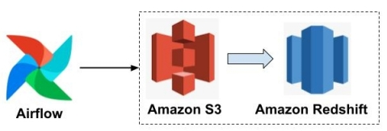


##### &nbsp;
## Project Scope

### Datasets
For this project, we'll be working with two datasets that reside in S3. Here are the S3 links for each:

- Song data: `s3://udacity-dend/song_data`
- Log data: `s3://udacity-dend/log_data`
  - Log data json path: `s3://udacity-dend/log_json_path.json`

#### Song Dataset
The first dataset is a subset of real data from the [Million Song Dataset](https://labrosa.ee.columbia.edu/millionsong/). Each file is in JSON format and contains metadata about a song and the artist of that song. The files are partitioned by the first three letters of each song's track ID. For example, here are filepaths to two files in this dataset.

`song_data/A/B/C/TRABCEI128F424C983.json`
`song_data/A/A/B/TRAABJL12903CDCF1A.json`

And below is an example of what a single song file, `TRAABJL12903CDCF1A.json`, looks like.

```
{"num_songs": 1, "artist_id": "ARJIE2Y1187B994AB7", "artist_latitude": null, "artist_longitude": null, "artist_location": "", "artist_name": "Line Renaud", "song_id": "SOUPIRU12A6D4FA1E1", "title": "Der Kleine Dompfaff", "duration": 152.92036, "year": 0}
```

#### Log Dataset
The second dataset consists of log files in JSON format generated by this [event simulator](https://github.com/Interana/eventsim) based on the songs in the dataset above. These simulate app activity logs from an imaginary music streaming app based on configuration settings.

The log files in the dataset you'll be working with are partitioned by year and month. For example, here are filepaths to two files in this dataset.

`log_data/2018/11/2018-11-12-events.json`
`log_data/2018/11/2018-11-13-events.json`

Below is an example of what the data in a log file, `2018-11-12-events.json`, looks like.


##### &nbsp;
## Schema Design 

We have designed the following Star Schema after analyzing both the song data and log data.


##### &nbsp;
### Project Structure

* /
    * `create_tables.sql` - Contains the DDL for all tables used in this project
* dags
    * `udac_example_dag.py` - The DAG configuration file to run in Airflow
* plugins
    * operators
        * `stage_redshift.py` - Operator to read files from S3 and load into Redshift staging tables
        * `load_fact.py` - Operator to load the fact table in Redshift
        * `load_dimension.py` - Operator to read from staging tables and load the dimension tables in Redshift
        * `data_quality.py` - Operator for data quality checking
    * helpers
        * `sql_queries` - Redshift statements used in the DAG

## Building the operators
### Stage Operator
    * Loads JSON and CSV files from S3 to Amazon Redshift
    * Creates and runs a `SQL COPY` statement based on the parameters provided
    * Parameters should specify where in S3 file resides and the target table
    * Parameters should distinguish between JSON and CSV files
    * Contain a templated field that allows it to load timestamped files from S3 based on the execution time and run backfills
### Fact and Dimension Operators
    * Use SQL helper class to run data transformations
    * Take as input a SQL statement and target database to run query against
    * Define a target table that will contain results of the transformation
    * Dimension loads are often done with truncate-insert pattern where target table is emptied before the load
    * Fact tables are usually so massive that they should only allow append type functionality
### Data Quality Operator
    * Run checks on the data
    * Receives one or more SQL based test cases along with the expected results and executes the tests
    * Test result and expected results are checked and if there is no match, operator should raise an exception and the task should retry and fail eventually


##### &nbsp;
### Run the Project 

-  ### Step 01: Start an AWS Redshift Cluster
Create and configure an AWS Redshift Cluster either directly from AWS Console or using Infrastructure as a Code (IAC). Here is an screenshot from AWS Console:
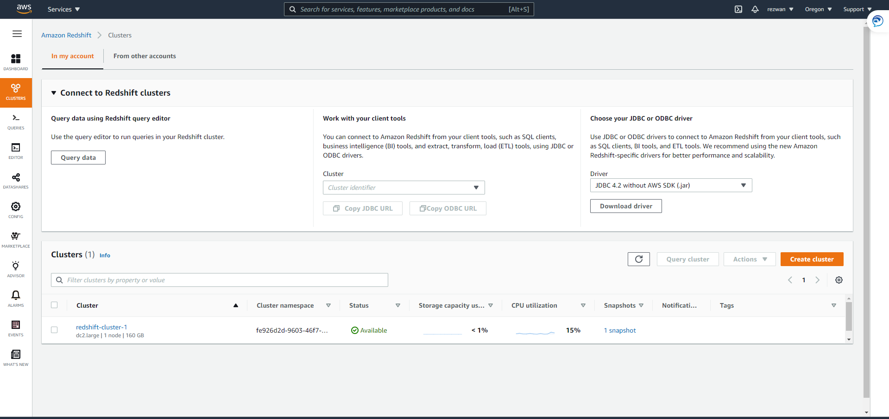

Once the cluster is created, please take note of the endpoint. We will use this endpoint in Step 03: 
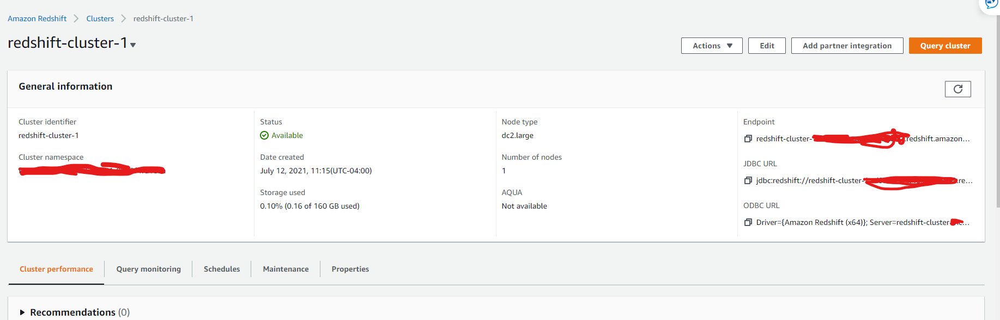

Also, while configuring the cluster, please make sure that it is publicly accessible: 
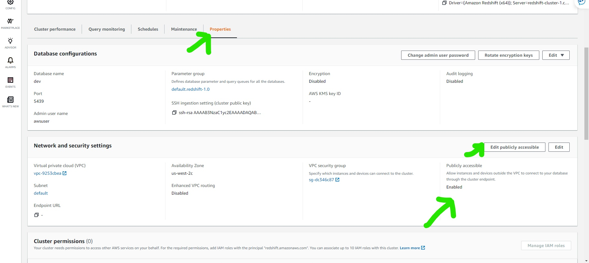


- ### Step 02: Create tables
Create tables by copying all the queries in the file [create_tables.sql](./create_tables.sql) into the Redshift query editor in the AWS web console.
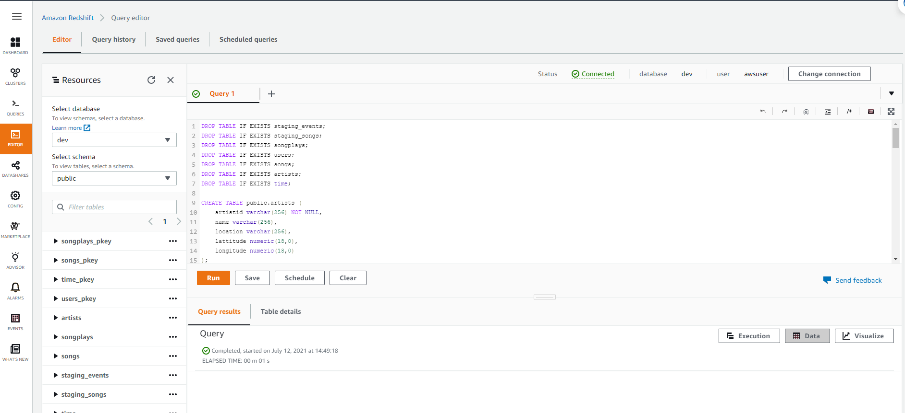

- ### Step 03:Login to the web UI of Airflow at http://localhost:8080 

Option 1: Running Apache Airflow in Docker

Copy the [Docker Compose file](./docker-compose.yaml)
to the current directory and start Airflow server by
```sh
docker-compose up
```
Option 2: use the deafult project environment provided by udacity and run the following command first from the console:

```sh
/opt/airflow/start.sh
```
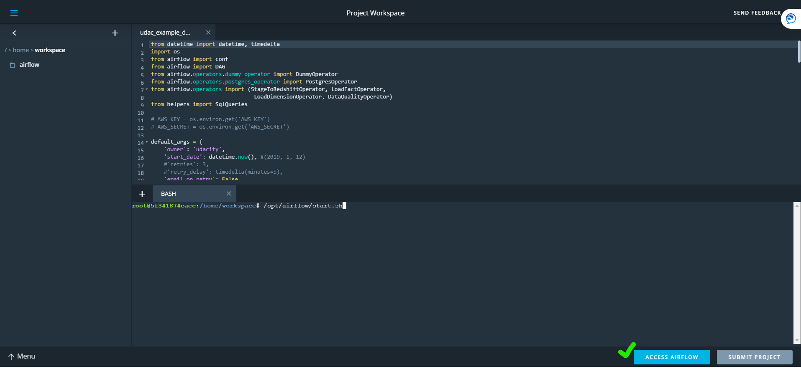

Once the server is ready, click on the ACCESS AIRFLOW BUTTON and should Open the Airlow UI in localhost. 
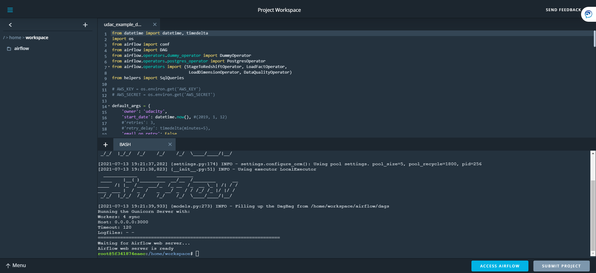


- ### Step 04: Use Airflow's UI to configure your AWS credentials and connection to Redshift.

1. Click on the Admin tab and select Connections.

2. Under Connections, Select Create

3.On the create connection page, enter the following values:
>- **Conn Id**: Enter aws_credentials.
>- **Conn Type**: Enter Amazon Web Services.
>- **Login**: Enter your Access key ID from the IAM User credentials you downloaded earlier.
>- **Password**: Enter your Secret access key from the IAM User credentials that you downloaded earlier. Click Save and Add another

4.On the next create connection page, enter the following values:
>- **Conn Id**: Enter redshift.
>- **Conn Type**: Enter Postgres.
>- **Host**: Enter the endpoint of your Redshift cluster, excluding the port at the end. You can find this by selecting your cluster in the Clusters page of the Amazon Redshift console. See where this is located in the screenshot above. IMPORTANT: Make sure to NOT include the port at the end of the Redshift endpoint string.
>- **Schema**: Enter dev. This is the Redshift database you want to connect to.
>- **Login**: Enter awsuser.
>- **Password**: Enter the password you created when launching your Redshift cluster.
>- **Port**: Enter **5439**

Once you've entered these values, select Save.

- ### Step 05: Run the DAG
Once the configuration is done, Click the DAGs tab. You should be able to see all the available dags here. Turn on the dag and then trigger the dag to initiate the process. 
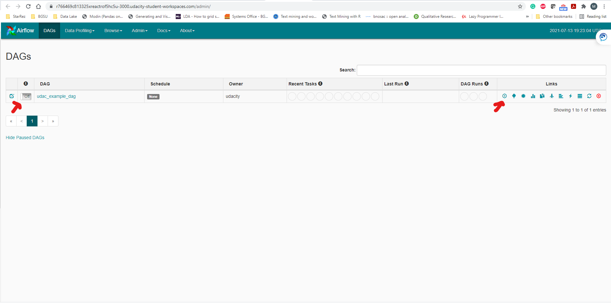
If you look at the Graph view, you should be able to see the steps of the dag. 
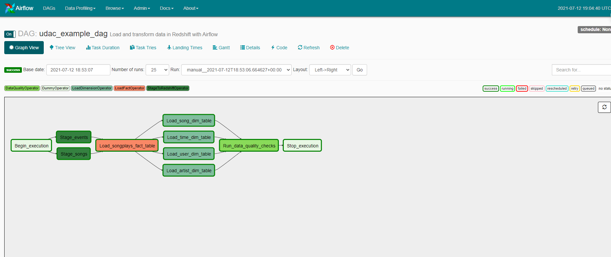

You have to wait for a while. If everything goes smoothly, you will find all green icons in the Tree View as well as in the DAG's Tab. Here is a screenshot from the Tree view:
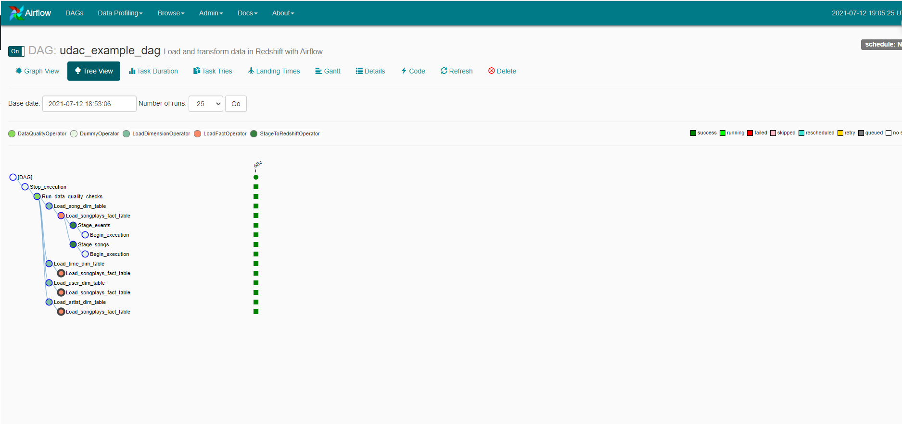


##### &nbsp;
### Result 
Results from the data quality check operator:
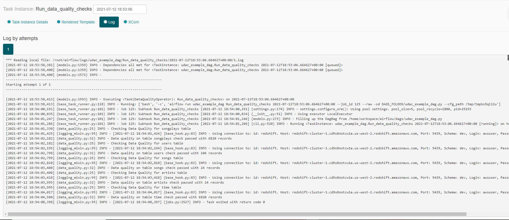

Sample Query Results:

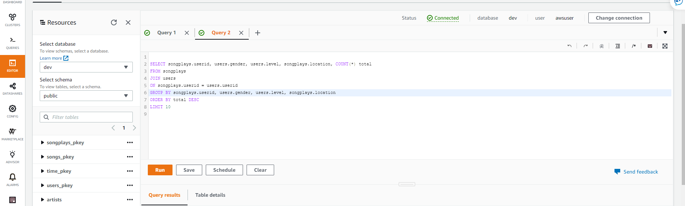

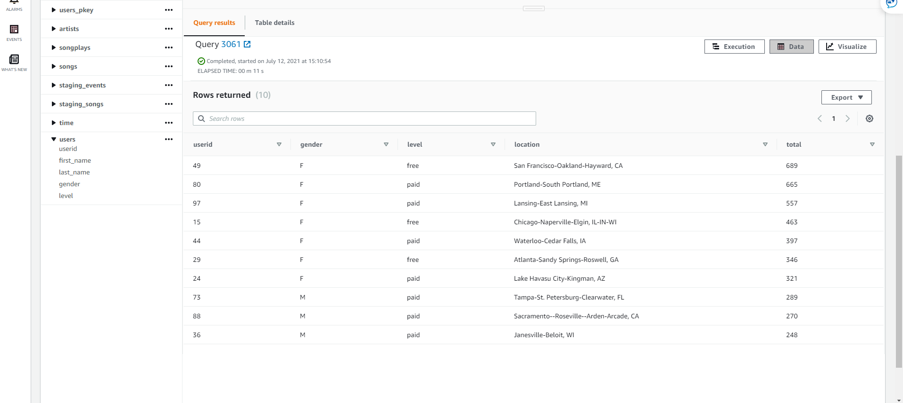

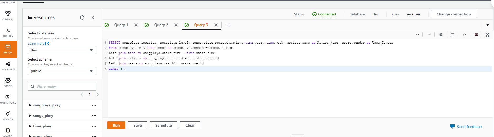

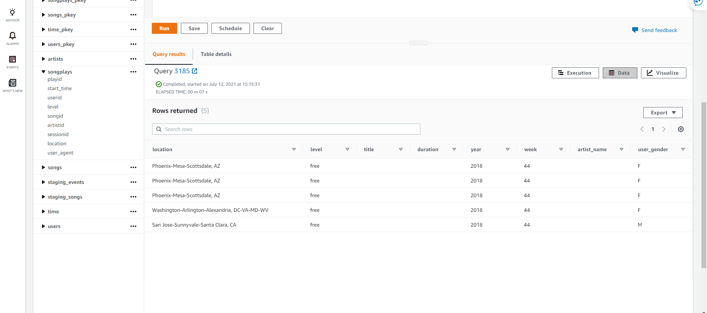


###Clean Up Resources
Congratulations, you just deployed an ETL data pipeline with Apache Airflow and Amazon EMR. Remember to delete your S3 bucket and EMR cluster in order to avoid unexpected costs.


## Additional Resources 

* **Apache Airflow:** This amazing medium post describes different issues with creating, navigating and other related staffs. Have a look at it [Apache Airflow Tips](https://towardsdatascience.com/5-essential-tips-when-using-apache-airflow-to-build-an-etl-pipeline-for-a-database-hosted-on-3d8fd0430acc). Especially Tip 1 - Start with the simplest DAG and Tip 2 - How to stop/kill Airflow tasks from the Airflow UI?


